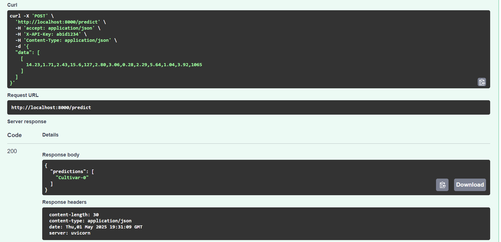

# Securing FastAPI Endpoints

This project demonstrates how to implement a simple API authentication in FastAPI Machine Learning applications.


## Prerequisites

- Python 3.8+
- pip (Python package manager)

## Installation

1. Clone the repository:
```bash
git clone https://github.com/kingabzpro/securing-fastapi-endpoints.git
cd securing-fastapi-endpoints
```

2. Create a virtual environment:
```bash
python -m venv venv
source venv/bin/activate  # On Windows: venv\Scripts\activate
```

3. Install dependencies:
```bash
pip install -r requirements.txt
```

## Configuration

1. Create a `.env` file in the root directory with the following variables:
```env
API_KEY=abid1234
```

## Running the Application

1. Start the FastAPI server:
```bash
python main.py
```

2. Access the API documentation at:
- Swagger UI: http://localhost:8000/docs
- ReDoc: http://localhost:8000/redoc

## API Endpoints

- `POST /predict`: Predicts the output for a given input

## Testing

```bash
sh test.sh
```
```bash
Testing API endpoint scenarios...

Test 1: Missing API Key
{"detail":"Invalid API Key"}
Test 2: Wrong API Key
{"detail":"Invalid API Key"}
Test 3: Happy Path
{"predictions":["Cultivar-0"]}
```
## License

This project is licensed under the MIT License - see the [LICENSE](LICENSE) file for details. 